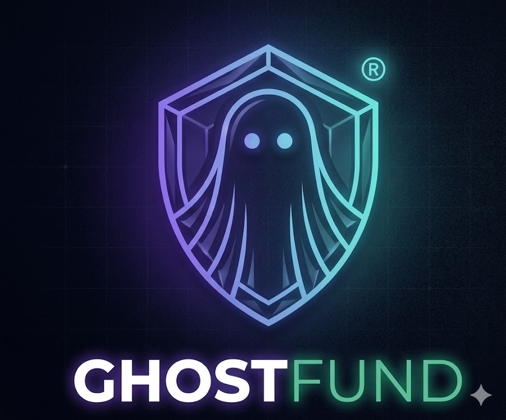
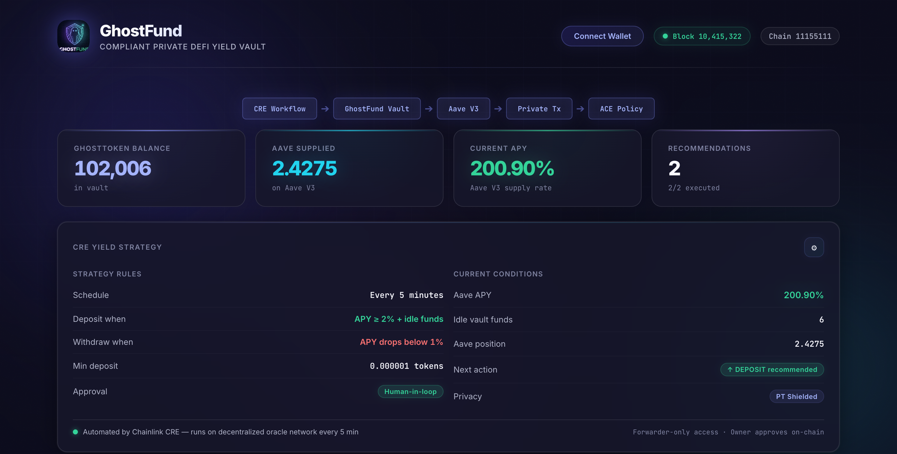
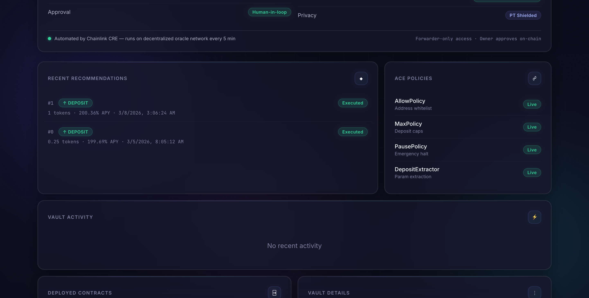
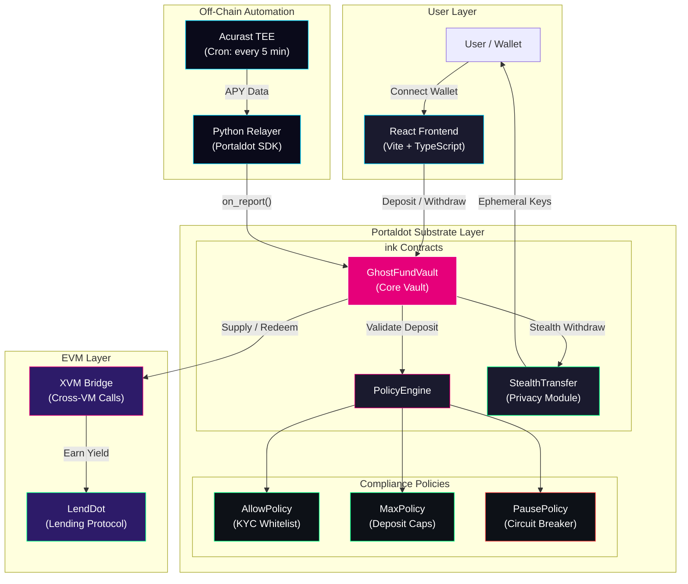

<p align="center">
  
</p>

# GhostFund: Private DeFi Yield with Human-Gated Automation


Compliant private yield vault that automates DeFi strategy monitoring, moves funds with sender privacy, and enforces deposit compliance at the smart contract level. GhostFund bridges the robust security of Rust-based `ink!` smart contracts with the deep liquidity of EVM-based DeFi protocols via the Portaldot Dual-VM ecosystem.

[]()
[](https://use.ink/)
[](https://www.typescriptlang.org/)
[]()
[](LICENSE)

---

## Live Demo


Connect your Web3 wallet on the Portaldot Testnet to view live vault data, approve yield recommendations, and interact with the vault.


---

## What Is GhostFund?

GhostFund is a next-generation DeFi vault on Portaldot that combines three core primitives into one system: 
1. **Automated Yield:** Off-chain Acurast TEE monitors yields and recommends actions via a Python relayer.
2. **Privacy Engine:** Stealth transfers (adapted ERC-5564) hide the sender when distributing funds.
3. **Compliance Engine:** A modular PolicyEngine enforces allowlists, deposit caps, and emergency pauses on every deposit.

No funds move without the vault owner's explicit approval or predetermined automated conditions.

---

## Screenshots

| Dashboard | Operations |
|-----------|------------|
|  |  |

---

## Features

- **Automated yield monitoring**: Acurast TEE checks DeFi yields (e.g., LendDot) and generates recommendations via the Portaldot SDK.
- **Human-in-the-loop approval**: Owner must approve actions within a TTL window or configure automated XVM rebalancing.
- **Private fund distribution**: Stealth addresses hide sender identity. Recipients redeem via cryptographic derivations.
- **On-chain compliance**: PolicyEngine enforces AllowPolicy (address whitelist), MaxPolicy (deposit caps), and PausePolicy (circuit breaker) in native `ink!`.
- **Dual-VM Integration**: Cross-VM (XVM) calls seamlessly interact with EVM-based liquidity pools.
- **Interactive dashboard**: Modern React/Vite/TypeScript frontend reads live Portaldot data and connects to Web3 wallets.

---

## Tech Stack

| Layer | Technology |
|-------|------------|
| Smart Contracts | Rust, `ink!`, Portaldot Substrate |
| Yield Automation | Acurast TEE, Python, Portaldot SDK |
| Privacy | Stealth Addresses (Adapted ERC-5564) |
| Compliance | Portaldot PolicyEngine |
| DeFi Protocol | LendDot (EVM) via XVM |
| Demo Scripts | TypeScript, Bun |
| Frontend | React, Vite, TypeScript, Tailwind/CSS |
| Testing | cargo-contract tests |

---

## Testing the App

### Part 1: Connect Wallet

1. Install a Web3 wallet (e.g., MetaMask or Polkadot.js) and switch to the Portaldot Testnet.
2. Get Testnet tokens from the official faucet.
3. Open the live dashboard (or serve locally, see Running Locally).
4. Click "Connect Wallet".

### Part 2: Vault Operations

5. Deposit GhostTokens into the vault using the Operations panel.
6. Supply idle vault funds to the DeFi protocol to start earning yield.
7. Check the Stats Banner for live balances: vault holdings, supplied amount, current APY.

### Part 3: Yield Strategy

8. View the Yield Strategy card for current market conditions and next recommended action.
9. When a recommendation appears in Recent Recommendations, review the action and amount.
10. Click "Approve" on a pending recommendation before the TTL expires.
11. Watch the Vault Activity feed for the resulting deposit or withdrawal transaction.

### Part 4: Demo Scripts (Terminal)

Run the demo flows to see the primitives in action:

```bash
# Yield: Recommendation + deposit
bun run scripts/demo-yield-flow.ts

# Privacy: Shielded transfer + redemption
bun run scripts/demo-privacy-flow.ts

# Compliance: Allowlist check, max limit, pause/unpause
bun run scripts/demo-compliance-flow.ts
```

### Part 5: Workflow Simulation

```bash
cd workflow-python && python main.py
```

The Python relayer reads reserve data, evaluates APY thresholds, and submits a signed strategy update to the vault's `on_report()` function.

---

## Smart Contracts

| Contract | Description |
|----------|-------------|
| `GhostFundVault` | Core `ink!` vault with XVM integration and approval pattern |
| `PortaldotPolicyEngine` | Compliance policy enforcement hub |
| `StealthTransfer` | Privacy module for stealth address announcements |

All contracts are built for the Portaldot ecosystem.

---

## Portaldot Capabilities

| Capability | How It's Used |
|------------|---------------|
| Dual-VM & XVM | Native Substrate calls to interact with EVM-based DeFi protocols |
| Portaldot SDK | Python relayer submits strategy transactions from the Acurast TEE |
| `ink!` Smart Contracts | Secure execution of compliance and privacy logic |

---

## Architecture



For a deep dive into the system design, please see [documentation.md](documentation.md).

---

## Running Locally

### Prerequisites

- Node.js (v18+) and npm
- Rust (`cargo`, `rustup`) with `wasm32-unknown-unknown` target
- Python 3.10+

### Setup

```bash
git clone https://github.com/joshuakatumba/Portaldot.git
cd Portaldot

# Frontend
cd frontend
npm install
npm run dev

# Contracts
cd ../contracts-ink
cargo contract build

# Workflow
cd ../workflow-python
pip install -r requirements.txt
python main.py
```

---

## Project Structure

```
Portaldot/
  contracts-ink/
    lib.rs                      Core vault: XVM integration + approval pattern
    policy_engine.rs            Compliance router
    stealth_transfer.rs         Privacy module
  workflow-python/
    main.py                     Python relayer for Acurast TEE
    requirements.txt            Python dependencies
  frontend/
    src/                        React components, context, and styles
    index.html                  Interactive dashboard entry point
  scripts/
    demo-yield-flow.ts          End-to-end yield demo
    demo-privacy-flow.ts        End-to-end privacy demo
    demo-compliance-flow.ts     End-to-end compliance demo
  documentation.md              Comprehensive technical documentation
```

---

## License

MIT
