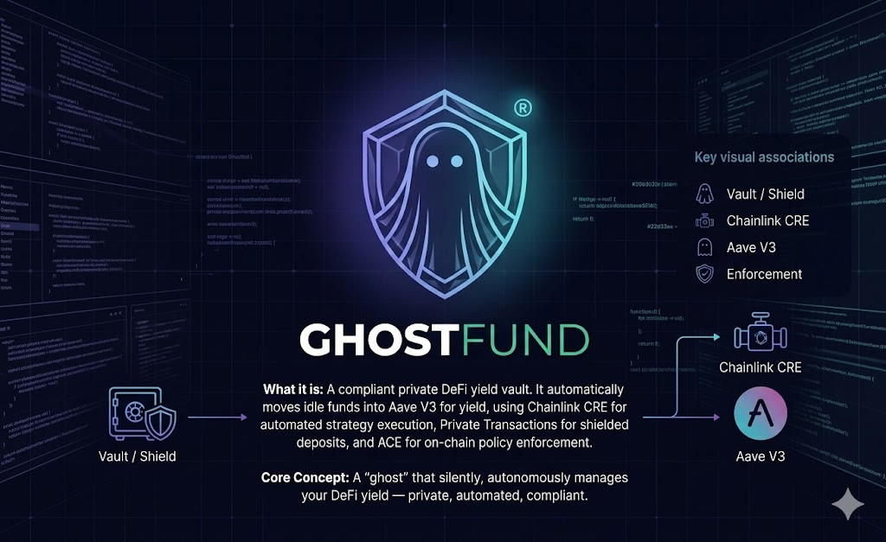

<p align="center">
  
</p>

# GhostFund: Private DeFi Yield with Human-Gated Automation

**Winner — Chainlink Convergence Hackathon 2026**

Compliant private yield vault that automates Aave V3 strategy monitoring, moves funds with sender privacy, and enforces deposit compliance at the smart contract level. The first DeFi vault to combine all three Chainlink primitives: CRE, Private Transactions, and ACE, into one system.

[]()
[](https://soliditylang.org/)
[](https://www.typescriptlang.org/)
[](https://chain.link/)
[]()
[](LICENSE)

---

## Live Demo

**[https://ghostfund.vercel.app](https://ghostfund.vercel.app)**

Connect MetaMask on Sepolia to view live vault data, approve CRE recommendations, and interact with the vault.

## Demo Video

**[https://youtu.be/_UiGqtLKlWI](https://youtu.be/_UiGqtLKlWI)**

---

## What Is GhostFund?

GhostFund is a DeFi vault on Sepolia that combines three Chainlink primitives into one system. CRE (Compute Runtime Environment) monitors Aave V3 yields and recommends actions. Private Transactions hide the sender when distributing funds. ACE (Access Control Engine) enforces allowlists, deposit caps, and emergency pauses on every deposit.

No funds move without the vault owner's explicit approval. Every recommendation expires after 1 hour if not approved.

---

## Screenshots

| Dashboard | Operations |
|-----------|------------|
|  |  |

<!-- TODO: Add screenshots after frontend deploy -->

---

## Features

- **Automated yield monitoring**: CRE workflow checks Aave V3 APY every 5 minutes and generates on-chain recommendations
- **Human-in-the-loop approval**: Owner must call `userApprove()` within a 1-hour TTL window. No autonomous fund movement
- **Private fund distribution**: Chainlink Private Transactions hide sender identity. Recipients redeem via cryptographic withdraw tickets
- **On-chain compliance**: ACE PolicyEngine enforces AllowPolicy (address whitelist), MaxPolicy (deposit caps), PausePolicy (circuit breaker)
- **Custom parameter extraction**: DepositExtractor contract parses calldata for ACE policy evaluation
- **Gas-optimized storage**: Struct packing reduces Recommendation storage from 6 slots to 4
- **Interactive dashboard**: Single-file frontend reads live Sepolia data, connects MetaMask, approves recommendations
- **74 tests**: Unit, fuzz (1000 runs), invariant (8192 calls), security, fork, and extractor tests

---

## Tech Stack

| Layer | Technology |
|-------|------------|
| Smart Contracts | Solidity 0.8.26, Foundry, OpenZeppelin |
| Chainlink CRE | TypeScript workflow, CronCapability, EVMClient |
| Chainlink PT | EIP-712 authenticated API, shielded transfers |
| Chainlink ACE | PolicyEngine, AllowPolicy, MaxPolicy, PausePolicy |
| DeFi Protocol | Aave V3 (Sepolia) |
| Demo Scripts | TypeScript, viem, Bun |
| Frontend | Static HTML, ethers.js v6 (CDN), MetaMask |
| Testing | Forge test (unit, fuzz, invariant, security, fork) |

---

## Testing the App

### Part 1: Connect Wallet

1. Install [MetaMask](https://metamask.io/) and switch to Sepolia testnet
2. Get Sepolia ETH from [sepoliafaucet.com](https://sepoliafaucet.com)
3. Open the live dashboard (or serve locally, see Running Locally)
4. Click "Connect Wallet". The app auto-switches to Sepolia if needed

### Part 2: Vault Operations

5. Deposit GhostTokens into the vault using the Operations panel (approve + deposit two-step)
6. Supply idle vault funds to Aave V3 to start earning yield
7. Check the Stats Banner for live balances: vault holdings, Aave supplied amount, current APY

### Part 3: CRE Yield Strategy

8. View the CRE Yield Strategy card for current market conditions and next recommended action
9. When a CRE recommendation appears in Recent Recommendations, review the action and amount
10. Click "Approve" on a pending recommendation before the 1-hour TTL expires
11. Watch the Vault Activity feed for the resulting Aave deposit or withdrawal transaction

### Part 4: Demo Scripts (Terminal)

Run the four demo flows to see all three Chainlink primitives in action:

```bash
# Yield: CRE recommendation + Aave deposit
bun run scripts/demo-yield-flow.ts

# Privacy: shielded transfer + on-chain redemption
bun run scripts/demo-privacy-flow.ts

# Compliance: allowlist check, max limit, pause/unpause
bun run scripts/demo-compliance-flow.ts

# Combined: withdraw Aave yield, distribute privately via PT
bun run scripts/demo-private-yield-flow.ts
```

### Part 5: CRE Workflow Simulation

```bash
cd workflow && ~/.cre/bin/cre simulate
```

The workflow reads Aave reserve data, evaluates APY thresholds with hysteresis, and writes a signed recommendation to the vault's `onReport()` function.

---

## Smart Contracts

| Contract | Address | Description |
|----------|---------|-------------|
| GhostFundVault | `0x4964991514f731CB3CF252108dFF889d30036fcb` | Core vault with Aave integration and approval pattern |
| GhostToken | `0xB9431b3be9a56a1eeA8E728326332f8B4dD51382` | ERC-20 token registered in PT Vault |
| PolicyEngine | `0x73247d30cb15eF7884D8f8992D7D1692c7f6a1E4` | ACE policy enforcement hub |
| AllowPolicy | `0xB9fa55C5f14Fac82e6b9133284bE9EF912dbA33e` | Address whitelist for depositors |
| MaxPolicy | `0xfD46dE36745402238826672af2132e59f1caDbBA` | Per-deposit amount caps |
| PausePolicy | `0x9A9a6BB879F51A89A340305d1fFf92A0873A938f` | Emergency circuit breaker |
| DepositExtractor | `0x15fb3265fefc1cB42A2c990DED55fb3a448689d4` | Extracts calldata params for policy checks |
| PT Vault | `0xE588a6c73933BFD66Af9b4A07d48bcE59c0D2d13` | Private Transactions vault |
| Aave V3 Pool | `0x6Ae43d3271ff6888e7Fc43Fd7321a503ff738951` | Aave lending pool (Sepolia) |

All contracts deployed on Ethereum Sepolia testnet.

---

## Chainlink Capabilities

| Capability | How It's Used |
|------------|---------------|
| CRE CronCapability | Triggers workflow every 5 minutes |
| CRE EVMClient.callContract | Reads Aave reserve data and vault balances |
| CRE EVMClient.writeReport | Writes signed recommendation to vault |
| CRE runtime.report() | Consensus-signed report payload |
| Private Transactions API | Shielded transfers, balance queries, withdraw tickets |
| ACE PolicyEngine | Policy enforcement (allow, max, pause) |
| ACE DepositExtractor | Custom parameter extraction for deposit checks |

---

## How It Works

```
                        CRE Workflow (off-chain)
                        ========================
                        Cron: every 5 minutes
                        Reads: Aave APY + vault balance
                        Logic: threshold + hysteresis + dust guard
                              |
                              | onReport() (signed)
                              v
               +-----------------------------+
               |       GhostFundVault        |
               |       (Sepolia)             |
               |-----------------------------|
               | Stores Recommendation       |
               | Owner calls userApprove()   |
               | 1-hour TTL enforcement      |
               +-----------------------------+
                    |                    |
          deposit   |                    | withdraw
                    v                    v
            +-------------+     +------------------+
            | Aave V3     |     | Private Tx       |
            | Pool        |     | (PT Vault)       |
            | yield via   |     | EIP-712 auth     |
            | aToken      |     | hidden sender    |
            | rebasing    |     | withdraw tickets |
            +-------------+     +------------------+
                                        |
                                        v
                              +------------------+
                              | ACE PolicyEngine |
                              | AllowPolicy      |
                              | MaxPolicy        |
                              | PausePolicy      |
                              +------------------+
```

**Strategy logic**: Deposit when APY exceeds the configured threshold and the vault holds enough idle balance to clear the dust guard. Withdraw when APY drops below half the threshold (hysteresis prevents oscillation). No action when conditions are unchanged.

**Security model**: The `onReport()` function validates both `msg.sender` (Keystone Forwarder allowlist) and the workflow owner from report metadata. The human approves; the CRE recommends. Separation of concerns prevents autonomous fund movement.

---

## Architecture

<p align="center">
  
</p>

---

## Running Locally

### Prerequisites

- [Foundry](https://book.getfoundry.sh/) (forge, cast)
- [Bun](https://bun.sh/) (v1.0+)
- [CRE CLI](https://github.com/smartcontractkit/cre-cli) (v1.2+)

### Setup

```bash
git clone https://github.com/dmustapha/ghostfund.git
cd ghostfund

cp .env.example .env
# Set PRIVATE_KEY and SEPOLIA_RPC_URL

cd contracts && forge install && forge build && cd ..
cd scripts && bun install && cd ..
cd workflow/workflow && bun install && cd ../..
```

### Run Tests

```bash
cd contracts

# All tests (unit, fuzz, invariant, security, extractor)
forge test

# Fork tests against live Aave Sepolia
forge test --match-contract ForkTest --fork-url $SEPOLIA_RPC_URL
```

### Run Dashboard

```bash
python3 -m http.server 8888
# Open http://localhost:8888/frontend/index.html
```

Serve over `http://` (not `file://`) for MetaMask wallet injection.

---

## Test Coverage

| Suite | Tests | Status |
|-------|-------|--------|
| Unit | 47 | Pass |
| Fuzz (1000 runs each) | 8 | Pass |
| Invariant (8192 calls) | 3 | Pass |
| Security | 5 | Pass |
| Fork (live Aave Sepolia) | 6 | Pass |
| Extractor | 5 | Pass |
| **Total** | **74** | **All pass** |

---

## Project Structure

```
ghostfund/
  contracts/
    src/
      GhostFundVault.sol          Core vault: Aave integration + approval pattern
      GhostToken.sol              ERC-20 registered in PT Vault
      DepositExtractor.sol        ACE parameter extractor for policy checks
      IPool.sol                   Aave V3 pool interface
      MockPool.sol                Test mock for Aave pool
    test/
      GhostFundVault.t.sol        Unit tests (47)
      GhostFundVault.fuzz.t.sol   Fuzz tests (8, 1000 runs each)
      GhostFundVault.invariant.t.sol  Invariant tests (3, 8192 calls)
      GhostFundVault.security.t.sol   Security tests (5)
      GhostFundVault.fork.t.sol   Fork tests against live Aave (6)
      DepositExtractor.t.sol      Extractor tests (5)
    scripts/
      DeployGhostFund.s.sol       Deploy vault + token
      DeployACE.s.sol             Deploy ACE policies
      ConfigureACEPolicies.s.sol  Configure policy engine
      ConfigureVaultAccess.s.sol  Set forwarder + workflow owner
  scripts/
    demo-yield-flow.ts            End-to-end yield demo
    demo-privacy-flow.ts          End-to-end privacy demo
    demo-compliance-flow.ts       End-to-end compliance demo
    demo-private-yield-flow.ts    Yield + privacy combined
    lib/
      pt-client.ts                PT API client (EIP-712 auth)
      abis.ts                     Shared ABI definitions
      constants.ts                Contract addresses + PT types
  workflow/
    workflow/
      main.ts                     CRE workflow (strategy logic)
      config.json                 APY threshold, schedule, addresses
    project.yaml                  CRE project configuration
  frontend/
    index.html                    Interactive dashboard (static, no build step)
  assets/
    ghostfund-logo.jpg            Project logo
    ghostfund-architecture.jpg    Architecture diagram
```

---

## Hackathon

**Winner — Chainlink Convergence Hackathon 2026**

**Privacy Track** (primary): Private Transactions enable shielded fund movement where sender identity is hidden. GhostToken is registered in the PT Vault with a PolicyEngine that enforces compliance before any private transfer. Recipients redeem on-chain via cryptographic withdraw tickets.

**DeFi and Tokenization Track** (secondary): CRE automates yield strategy monitoring on Aave V3, recommending deposit/withdraw actions based on APY thresholds with hysteresis. The human-in-the-loop approval pattern ensures no autonomous fund movement.

All three Chainlink primitives (CRE, Private Transactions, ACE) work together: CRE monitors and recommends, the vault earns yield on Aave, Private Transactions enable private fund distribution, and ACE enforces compliance at every entry point.

---

## License

MIT
# Ghost-Fund
# Portaldot
# Portaldot
